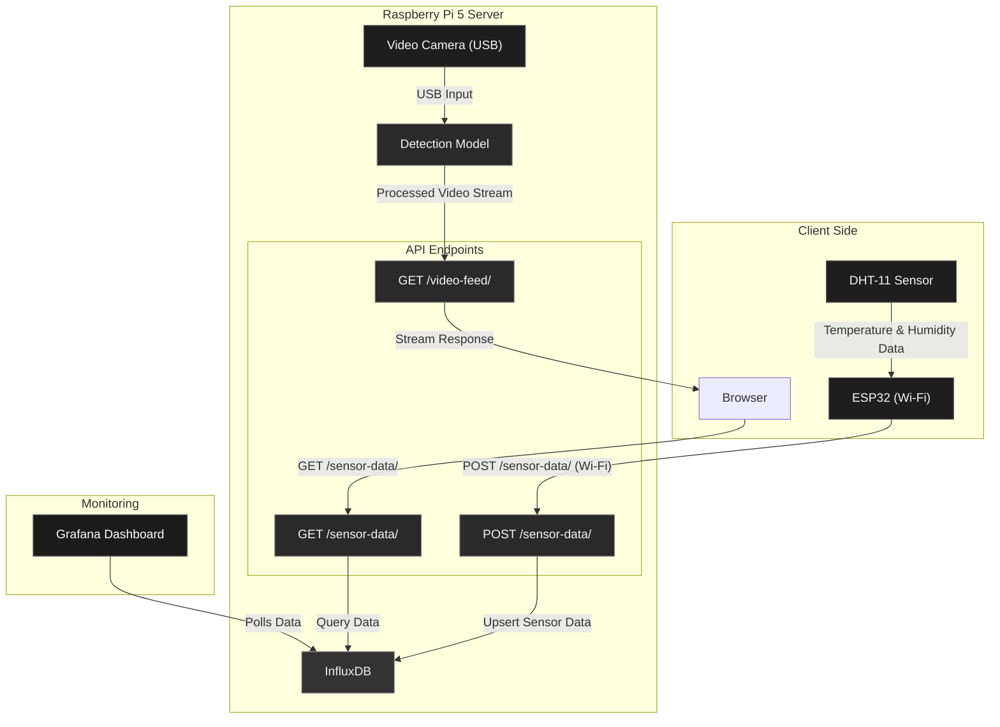

# PiServe

PiServe is an IoT server application designed for the Raspberry Pi that enables real-time video streaming with integrated object detection and collects environmental data from IoT sensors such as the ESP32 with a DHT11 sensor.  
It integrates **InfluxDB** for time-series data storage and **Grafana** for observability and visualization.

---

## Features

- Real-time temperature and humidity monitoring using DHT11 sensors connected to ESP32 devices  
- RESTful API endpoints for data exchange  
- InfluxDB for time-series data persistence  
- Grafana dashboards for live analytics and alerts  
- Real-time object detection using pre-trained models  
- Live camera streaming via HTTP endpoint  

---

## Project Structure

```
PiServe/
├── server_peripherals/          # Python backend application
│   ├── main.py                  # FastAPI server implementation
│   ├── *.caffemodel             # Pre-trained object detection models
│   └── *.prototxt               # Model configuration files
├── venv/                        # Python virtual environment
└── requirements.txt             # Python dependencies

```

--- 

## System Architecture



---

## InfluxDB Integration

PiServe uses **InfluxDB** to store and manage time-series sensor data.

* The endpoint `/sensor-data/` (POST) receives data from the ESP32.
* The server **upserts** temperature and humidity values into the **InfluxDB** bucket (e.g., `temp_monitor`).
* The data includes fields:

  * `_measurement`: `temperature_humidity`
  * `_field`: `temperature` or `humidity`
  * `_value`: numeric sensor reading

InfluxDB allows efficient querying and aggregation of metrics, which are then visualized in Grafana.

---

## Grafana Integration

PiServe integrates **Grafana** to provide a real-time observability dashboard.

* **Data Source:** InfluxDB (configured with bucket `temp_monitor`)
* **Dashboard Panels:**

  * Current temperature and humidity (gauge panels)
  * 24-hour temperature and humidity trends (timeseries panels)
  * Statistical overview (mean, max, min, last not null)
* Grafana periodically **polls InfluxDB** to retrieve the latest metrics for visualization and alerting.

To enable Grafana:

1. Add InfluxDB as a data source in Grafana (`Settings → Data Sources → Add data source → InfluxDB`).
2. Import the provided JSON dashboard file (e.g., `HPC_temp.json`).
3. Configure alert thresholds directly from Grafana if needed.

---

## Prerequisites

* Raspberry Pi 5 with camera module (or compatible USB webcam)
* Python 3.12 or higher
* ESP32 with DHT11 sensor
* Installed and running:

  * **InfluxDB** (v2.x)
  * **Grafana** (v9+)

---

## Installation

### 1. Clone Repository

```bash
git clone https://github.com/shubh-man007/PiServe.git
cd PiServe
```

### 2. Set Up Python Environment

```bash
python3 -m venv venv
source venv/bin/activate
pip install -r requirements.txt
```

### 3. Start Backend Server

```bash
cd server_peripherals
uvicorn main:app --reload --host 0.0.0.0 --port 8000
http://<raspberry-pi-ip>:8086 # Influx DB
http://<raspberry-pi-ip>:3000 #Grafana
```

---

## Usage

### Accessing Camera Feed

Open in a web browser:

```
http://<raspberry-pi-ip>:8000/video-feed/
```

### ESP32 Sensor Integration

1. Configure your ESP32 with the Raspberry Pi’s IP in its Wi-Fi client code.
2. Ensure both ESP32 and Raspberry Pi are on the same network.
3. The ESP32 automatically sends temperature and humidity readings via `POST /sensor-data/`.

---

## API Endpoints

| Endpoint        | Method | Description                                             |
| --------------- | ------ | ------------------------------------------------------- |
| `/sensor-data/` | POST   | Receives sensor data from ESP32 and writes to InfluxDB  |
| `/sensor-data/` | GET    | Fetches sensor data from InfluxDB                       |
| `/video-feed/`  | GET    | Streams the processed video feed with detection overlay |

---